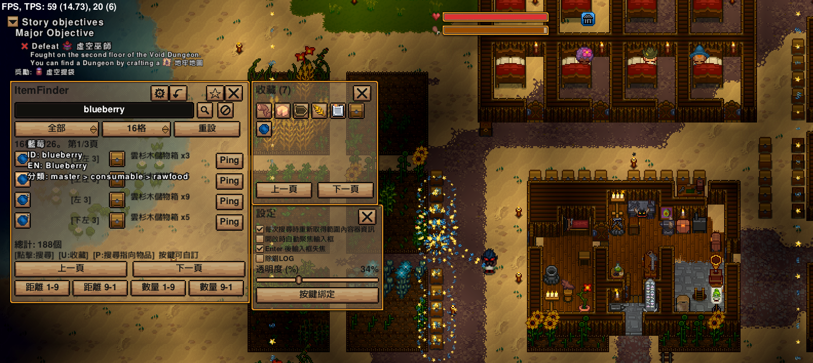

# ItemFinder



Necesse 1.3 的客戶端找物 Mod。

由 Where Is My Stuff 模組啟發
使用 Opencode 開發的 Mod
除非自己用不順或遇到 BUG 否則不會更新
2026-09-18

## 功能

可使用物品名稱、英文原文、英文 ID、英文類別來做搜尋
（也於 MOD 提供的提示中提供這些資訊以便使用）

有 歷史紀錄、收藏、篩選類別下拉、搜尋範圍設定

搜尋或按下 MOD 面板提供的物品時會產生粒子效果提示位置
也可以標記出容器的位置
（搜尋會最多顯示每個容器中符合條件的三個道具）

## 預設按鍵（可去按鍵設定修改）

- `Y` > 開啟搜尋頁面
- `U` > 新增指到的物品至收藏
- `P` > 直接搜尋指到的物品

## 注意

只是為了讓大家玩方便點而已。
不准營利，不准以任何方式危害別人（尤其是發佈有毒的檔案等）。

## 語言

使用機翻 - 支援：English、日文、簡中、繁中

## 建置

```bat
gradlew.bat buildModJar
```

產出：`build/jar/ItemFinder-<遊戲版本>-<Mod版本>.jar`
